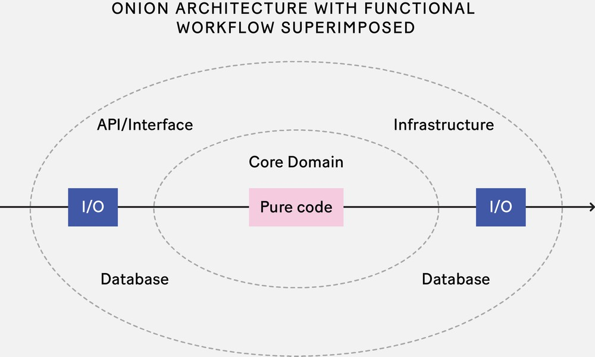

## A primer on functional architecture

Many articles on functional programming, or FP, focus on low-level coding
practices (such as avoiding side effects) and FP-specific patterns (such as the
dreaded monad). They don’t, however, touch on high-level design and
architecture. Yet FP principles can be applied at larger scales. In fact, many
popular frameworks and architectural styles, from serverless on the backend to
Redux/Elm-style frameworks on the frontend, have their roots in functional
programming.

When used appropriately, FP principles can reduce complexity while increasing
the testability and maintainability of an application. This is functional
architecture.

### The principles of FP applied to software architecture

Three principles of functional programming are especially relevant to software
architecture. The first is that functions are standalone values. That is, they
can be treated just like other standalone values, such as integers and strings.
They can be assigned to variables, stored in lists, passed as parameters,
returned as results, and so on.

In a functional architecture, the basic unit is also a function, but a much
larger business-oriented one that I like to call a workflow. Each workflow
represents a unit of functionality—a feature, use case, scenario, story, or
whatever you want to call it. Just as functions are “things” at the coding
level, these workflows are things at the architectural level, and the basic
building blocks of the architecture.

Second, composition is the primary way to build systems. Two simple functions
can be composed just by connecting the output of one to the input of another.
The result is another function that can be used as a starting point for yet more
composition.

Composition is such an important concept that functional programmers have a
suite of standard tools, such as monads, that allow for composition even if the
inputs and outputs don’t quite match.

From an architectural perspective, the most obvious consequence of composing
bigger functions from smaller ones is that functional systems tend to look like
pipelines with inputs and outputs, rather than a message-oriented
request/response model.

Each workflow function generally has the same structure: Data is read, business
decisions are made and data transformed as needed, and, finally, any new data or
events are output at the other end. Each of these steps can in turn be treated
as a smaller function. Branching and other kinds of complexity may come into
play, but even as workflows get larger and more complicated, the data always
flows in one direction.

This compositional approach means we only combine the specific components we
need for a particular business workflow. There is no need for a traditional
layered architecture. As we add new features to our system, the functionality
required for each new workflow is defined independently, rather than grouped
into a database or services layer.

If we really do need exactly the same functionality within different workflows,
that functionality can be defined once as a subfunction and then reused as a
shared step in the workflows that need it. This is why the compositional
approach is so appealing: Workflows are designed and built as independent units,
containing just the functionality they need, yet we can still harness all the
benefits of reuse and componentization when we need to.

Finally, functional programmers try to use pure functions as much as possible. A
pure function is deterministic (a given input always results in the same output)
and has no side effects (such as mutation or I/O). They are very easy to test
(deterministic!) and easy to understand without drilling into their
implementation (no side effects!).

### Interacting with the outside world

Of course, at some point we will need to do I/O—reading and writing files,
accessing a database, and so on. Functional programmers try to keep this kind of
nondeterminism at the edges of the pipeline as much as possible. Some languages,
like Elm and Haskell, are very strict about this and don’t allow any deviation,
while others treat this more as a guideline than a rule.

This functional model is very similar to well-known approaches such as onion
architecture, hexagonal architecture (a.k.a. ports-and-adapters architecture),
and functional core, imperative shell. In all cases, the core domain—the pure
business logic—is isolated from the infrastructure. The infrastructure code
knows about the core domain, but not the other way around. Dependencies are
one-way only and I/O is kept at the edges.

Using only pure code for the business logic means there’s a clear distinction
between unit testing and integration testing. Unit testing is for the core
domain and is deterministic and fast, while integration testing is done on the
workflow from end to end.

One of the advantages of functional programming is that this isolation of
business domain from infrastructure occurs naturally. You don’t need to
encourage (or nag!) developers to use an onion architecture; it happens
automatically as a side effect of the FP approach.

### Boundaries and contexts

As software designers and architects, our next challenge is to decide how to
group these workflows or pipelines into logical units. As always, this is more
of an art than a science.

There are many guidelines that can help. The classic principles of low coupling
and high cohesion apply as much to functional code as to object-oriented code.
Or, to rephrase the common-closure principle: Code that changes together should
live together. More recently, the domain-driven design (DDD) community has put a
lot of emphasis on component boundaries and where, exactly, to draw them.

In DDD terminology, a grouping of related functionality is called a bounded
context, and each bounded context is treated as a mini-domain in its own right.
It typically corresponds to the logical encapsulation of a particular business
capability. We use the phrase “bounded context” instead of something like
“subsystem” because it keeps us focused on what’s important when we’re designing
a solution: being aware of the context and the boundaries. (Exactly how to
define these bounded contexts is a topic for another article.)

Why context? Because each context represents some specialized knowledge or
capability. Within the context, we share a common language, and the design is
coherent and unified. But, just like in the real world, information taken out of
context can be confusing or unusable.

    **A boundary that’s too broad or too vague is no boundary at all.**

Why bounded? In the real world, domains can have fuzzy boundaries. But in the
world of software, we want to reduce coupling between subsystems so that they
can evolve independently. Boundaries are key to ensuring that subsystems stay
separate, and can be maintained using standard software practices such as using
explicit APIs and avoiding dependencies such as shared code. In complex projects
with changing requirements, we must be ruthless about preserving the “bounded”
part of the bounded context. A boundary that’s too broad or too vague is no
boundary at all.

Autonomy is a crucial aspect of a bounded context. Having autonomy means that
the bounded context can make decisions without needing to wait on decisions or
information from other bounded contexts. That is, if one bounded context is
unavailable, the other bounded contexts can continue operating independently,
which is an important decoupling. Autonomy can also apply to the development
process. In general, a bounded context is best owned by a single team. Think of
a three-legged race: Two runners tied at the leg are much slower than two
runners free to run independently. The same applies to software components. If
two teams contribute to the same bounded context, they might end up pulling the
design in different directions as it evolves. It’s always better to have
separate and autonomous bounded contexts that can evolve independently than one
mega-context that tries to make everyone happy.

If we apply the concept of bounded contexts to a functional architecture, we end
up with a number of small, focused domains, each of which supports a number of
business workflows.These boundaries should be defined in such a way that the
workflows within them are autonomous, able to do their job without depending on
other systems.

In some cases, a long-running use case or scenario requires multiple workflows.
In this case, workflows in different contexts will need to communicate with each
other using events and other methods. However, it’s important to keep an
individual workflow within a single bounded context and never attempt to
implement a scenario “end to end” through multiple contexts. Allowing workflows
to reach inside multiple services will eventually cause our nicely decoupled
architecture to devolve into a tangle of unmaintainable dependencies—“a big ball
of mud.”

### The entity-service antipattern

** There may not be one right way to define boundaries, but there are certainly many wrong ways.**

There may not be one right way to define boundaries, but there are certainly
many wrong ways. A common antipattern for grouping functionality is the
“entity-service” approach, in which the services are built around entities
instead of workflows. That is, there is an “order” service, a “product” service,
and so on. This often results from naively transferring an object-oriented
design directly to a workflow-oriented architecture. A major problem with this
design is that a single business workflow will often require all of these
services to collaborate. If any one of them is unavailable, the entire workflow
will fail. And if the workflow needs to evolve, we may need to touch and update
code in many services at the same time, breaking the “code that changes together
should live together” rule.

Furthermore, just because a business workflow involves an entity, such as an
“order,” doesn’t mean it has anything in common with other workflows that use
that entity. For example, the “pay for an order” workflow and the “delete an
order” workflow both involve orders but have completely different business
logic. There’s no need for them both to depend on an arbitrary “order” service
that lumps a disparate set of functions together. And when other requirements,
such as security, scalability, and so on, come into play, we may find that
different workflows must be managed in very different ways. Coupling them will
only cause pain!

### Events

Now our workflow functions are grouped into bounded contexts and ready to be
used. But what triggers these business workflows? What causes an employee, user,
or automated process to initiate a workflow?

An event. That is, something changes in the outside world—a customer clicks a
button, an email arrives, an alert pops up. This is captured in the form of a
business event—for example, “order placed” or “email received.” In an FP
architecture, business events like these trigger workflows.

Furthermore, with this approach, the output of a workflow is also an event: a
notification that tells any downstream workflows that something important has
changed in the world. Changes that are specific to a particular workflow and
aren’t shared, such as database updates, aren’t emitted from the workflow as
events.

This is how we can assemble larger processes from these smaller workflows. Each
workflow is triggered by an event, and that workflow in turn generates more
events for downstream processes to consume. But how are the events communicated
between workflows? This depends on the specific requirements of the project. If
all of the workflows can live in the same process, it can be a simple in-memory
queue. But if workflows need to be deployed separately and independently, then
an external queue, service bus, or Kafka-style event log is the preferred
choice.

Note that in all cases the workflows interact asynchronously. This allows them
to stay independent and decoupled in both time and space. The
command-and-control approach, in which a workflow calls another workflow
directly, is rarely used.

If you’re familiar with event-driven architectures, this event-based approach
will be familiar. And, indeed, the FP approach of having individual pipelines is
very amenable to this architectural style.

### Logical versus physical architecture

** This description of separate workflows triggered by events is a logical view, not a physical one.**

It’s important to note that this description of separate workflows triggered by
events is a logical view, not a physical one.

The design goals so far have been aligned around business requirements, but we
also need to consider technical requirements. One point in favor of using
workflows as the unit of design is that they can be physically deployed in a
number of ways—for example, as microservices, independent serverless functions,
components inside a modular monolith, or even as an agent-based system in the
style of Erlang or Akka. The choice depends on the size and number of
development teams, security, scalability needs, and so on.

In some cases, a logical workflow may also be physically split into separate
parts. For instance, a workflow may start on the frontend and continue on the
backend via a synchronous API call.

It should be clear, then, that the logical and physical compositions of a system
aren’t the same and shouldn’t be conflated. But that doesn’t mean we can avoid
making decisions about the physical and implementation aspects of an
architecture. Monolith or serverless is an important determination that should
be considered early in the project. Similarly, the choice of programming
language and the choice of database aren’t reflected in a logical model like
this one, yet they’re critical architectural decisions.

### Frontend functional architecture

Frontend software architecture has become increasingly important with the rise
of SPAs and serious applications written entirely on the frontend. And as the FP
emphasis on immutability, one-way data flow, and I/O at the edges has proved
valuable for reducing complexity, the functional approach to frontend
architecture has become increasingly popular.

The most common functional frontend architecture is the Model-View-Update
architecture, also known as the Elm architecture. In this design, the
application contains an immutable model (representing the application state) and
two key functions: an update function that updates the model when a message or
event from the browser, such as a button click, occurs, and a view function that
renders a view (normally just HTML) from that model. The rendered view can
associate browser events with messages defined in the domain model so that a
subsequent button click, for instance in the browser, will trigger a domain
message, which in turn triggers the update function, which eventually renders a
new view, which is passed to the browser again. And so on, round and round.

### The power of functional programming principles

From microservices and serverless on the backend to MVU on the frontend,
knowledge of functional programming is key to understanding many modern
architectural styles.

Many good practices of software architecture—cohesion, decoupling, isolation of
I/O, etc.—arise naturally from applying functional-programming principles. For
example, we’ve seen that in a typical functional design each workflow is
constructed independently, comprising only the functionality it needs (which
maximizes cohesion), and that autonomy is emphasized at all levels, from
individual functions up to bounded contexts (decoupling). Furthermore, a
surefire way to enhance testability and maintainability is to keep the business
logic in pure, deterministic functions, and to use immutable data models to
force data changes to become explicit and unambiguous.

There are many ways to do software architecture, and there is no
one-size-fits-all approach. However, the potential benefits of using functional
programming principles are manifold, and I encourage you to investigate these
principles further—and maybe even apply them to your next project. Good luck!
